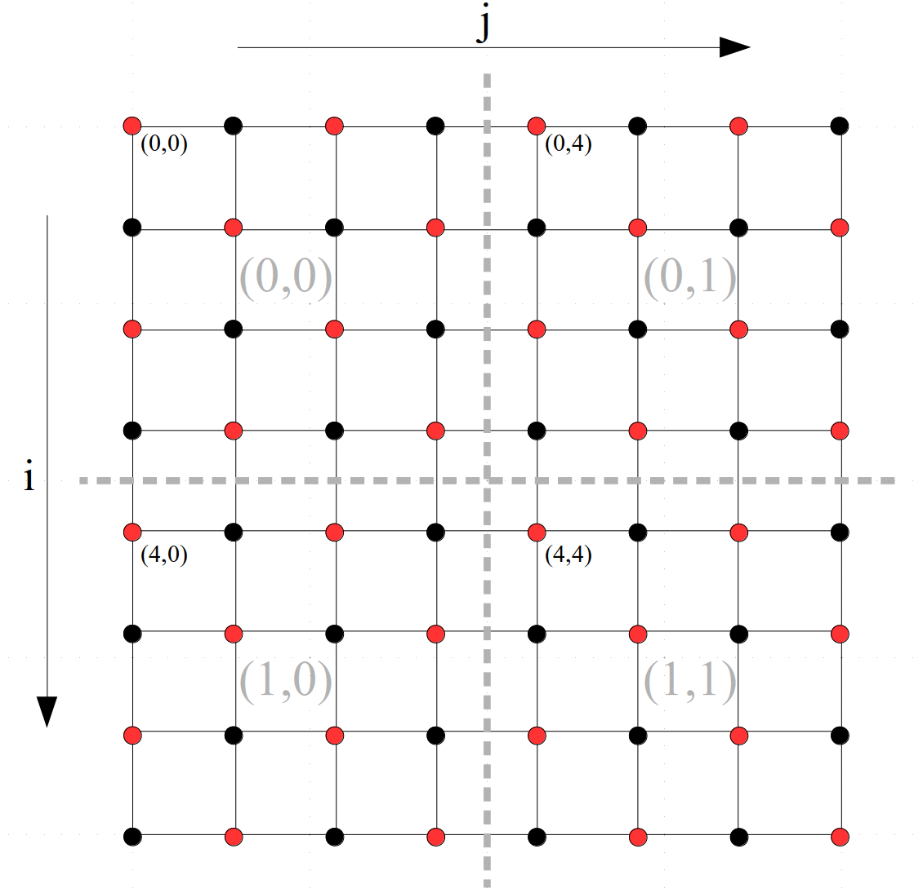

# Solution of Laplace's equation on a 2D mesh --- MPI+OpenMP+SIMD

This program solves Laplace's equation in 2D using a 5-point stencial
and the now old-fashioned and inefficient [Gauss-Seidel](https://en.wikipedia.org/wiki/Gauss%E2%80%93Seidel_method) or
successive over relaxation ([SSOR](https://en.wikipedia.org/wiki/Successive_over-relaxation)) method --- much
more efficient modern solvers exist.  However, we use this iteration
since the code is simple and it nicely illustrates use of the point-to-point
communication routines in MPI.

On the square domain 
we wish to solve Laplace's equation 

subject to the boundary conditions 

 (i.e., on the edges of the square). 

We approximate the Laplacian using a standard stencil 

.  

Setting this to zero, discretizing (evaluating on a grid) the solution so that  (with  for *N* grid points including those on the boundary), and interpreting the equation as a fixed point iteration yields (with *n* as the iteration index)

Overrelaxation tries to accelerate convergence by taking a bigger step.

The program chooses the optimum value for  for each grid spacing.

This iteration rapidly damps high-frequency errors but is very slow at eliminating low-frequency errors.  Since low-frequencies on a fine mesh appear as high-frequency on a coarse mesh, modern solvers use multigrid techniques (and more powerful iterative techniques) to cycle between fine and coarse meshes to greatly accelerate convergence.  We stop short of the complexity of a full multigrid solver and only solve on a sequence of increasingly fine meshes.

We are solving for the interior `(N-2)*(N-2)` points in the mesh.  Starting with a coarse mesh, we initialize the interior points to zero and set the boundary values.  We then iterate until the change between iterations is acceptably small.  Next, we interpolate onto a finer mesh with double the number of grid points, set the boundary values again, and then solve on that mesh.   This is by default done for four meshes.

The available parallelism is shown by coloring of the mesh points as red/black --- you can see that updating any red point only requires values from the neighboring black points, and vice versa.  Thus, we can update all of the red points in parallel, and then update all of the black points again in parallel.

To parallelize the calculation using MPI the proceessors are arranged into a 2D grid (`nrow_P,ncol_P`) that is depicted in gray in the figure. The rows and columns of the actual mesh are partitioned accordingly with the patch owned by each process identified by coordinate of the top-left cell in its local patch.

Since updating a value on the edge of the grid local to a processor requires data from the neighboring processor, these rows and edges must be exchanged before each update.  This is done in the routine `Exchange` --- this routine is actually sending twice as much data as necessary (it sends both red and black points each time but only needs to send one set at a time), and could also be made a bit more efficient by using asynchronous communication to decouple the order of execution each process.

The `i` loop is parallelized using OpenMP.

The `j` loop is vectorized.  This inner loop has stride 2 --- we can anticipate a factor of two speed up if we made it unit stride by storing the red and black points in separate arrays.  However, it would make the example code even more complicated.

Note that MPI is initialized to let it know we might be using threads but that only the main thread is going to be calling MPI routines while the other threads are sleeping.

With `NGRID=3844` these are timings from the four socket `sn-mem` SkyLake node (with the evironment variable `I_MPI_PIN_DOMAIN=socket` to bind all threads from an MPI process to the same socket).  The time is the operation time that includes the time taken for exchanging data (i.e., the communication cost).

P=#MPI processes

T=#OMP threads per process

Speedup = time / time for 1 process with 1 thread

Efficiency = Speedup/(P*T)

|  P  |  T  | Time(s) | Speedup | Efficiency |
|-----|-----|---------|---------|------------|
|1|1|103.90|1.0|100.0%|
|1|2|59.40|1.7|87.5%|
|1|3|35.50|2.9|97.6%|
|1|4|29.80|3.5|87.2%|
|1|6|22.90|4.5|75.6%|
|1|8|20.30|5.1|64.0%|
|1|10|18.10|5.7|57.4%|
|1|12|16.90|6.1|51.2%|
|1|14|16.30|6.4|45.5%|
|1|16|16.00|6.5|40.6%|
|1|18|15.70|6.6|36.8%|
|2|1|52.30|2.0|99.3%|
|2|2|25.40|4.1|102.3%|
|2|4|13.40|7.8|96.9%|
|2|8|8.42|12.3|77.1%|
|2|12|6.86|15.1|63.1%|
|2|16|6.22|16.7|52.2%|
|4|1|21.60|4.8|120.3%|
|4|2|11.50|9.0|112.9%|
|4|4|5.94|17.5|109.3%|
|4|8|3.43|30.3|94.7%|
|4|12|2.13|48.8|101.6%|
|4|15|1.70|61.1|101.9%|
|4|16|1.72|60.4|94.4%|
|8|8|1.67|62.2|97.2%|
|12|5|1.57|66.2|110.3%|
|15|4|1.71|60.8|101.3%|
|30|2|1.61|64.5|107.6%|
|40|1|2.42|42.9|107.3%|
|60|1|1.49|69.7|116.2%|

The following times are without binding threads to a socket.  This enables a single process OpenMP to access the full memory bandwidth of the system. The largest mesh at 118 MBytes is much larger than the L2 or L3 caches, and hence this application is limited by memory bandwidth.  Comparing the below with the above times, you can see that about 4 threads start to saturate the single-socket memory bandwidth. Also used `OMP_PROC_BIND=spread`.

|  P  |  T  | Time(s) | Speedup | Efficiency |
|-----|-----|---------|---------|------------|
|1|1|103.90|1.0|100.0%|
|1|2|59.80|1.7|86.9%|
|1|3|33.50|3.1|103.4%|
|1|4|29.60|3.5|87.8%|
|1|5|22.60|4.6|91.9%|
|1|6|16.00|6.5|108.2%|
|1|8|11.30|9.2|114.9%|
|1|12|7.91|13.1|109.5%|
|1|15|6.94|15.0|99.8%|
|1|20|5.10|20.4|101.9%|
|1|24|4.80|21.6|90.2%|
|1|30|4.24|24.5|81.7%|
|1|40|3.33|31.2|78.0%|
|1|60|2.83|36.7|61.2%|
|1|1|103.90|1.0|100.0%|
|2|1|52.70|2.0|98.6%|
|3|1|29.20|3.6|118.6%|
|4|1|27.30|3.8|95.1%|
|5|1|20.80|5.0|99.9%|
|6|1|16.90|6.1|102.5%|
|8|1|12.30|8.4|105.6%|
|12|1|8.06|12.9|107.4%|
|15|1|6.10|17.0|113.6%|
|20|1|5.06|20.5|102.7%|
|24|1|4.38|23.7|98.8%|
|30|1|4.00|26.0|86.6%|
|40|1|3.19|32.6|81.4%|
|60|1|1.98|52.5|87.5%|

